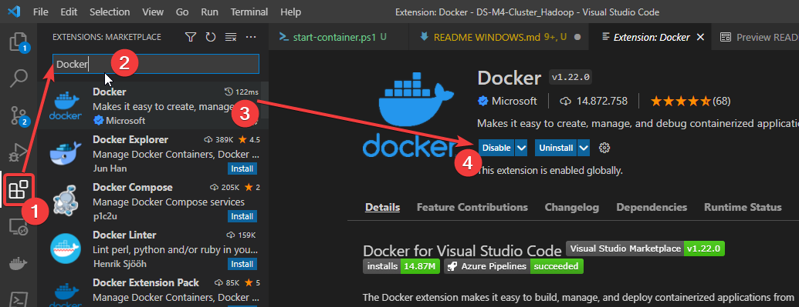
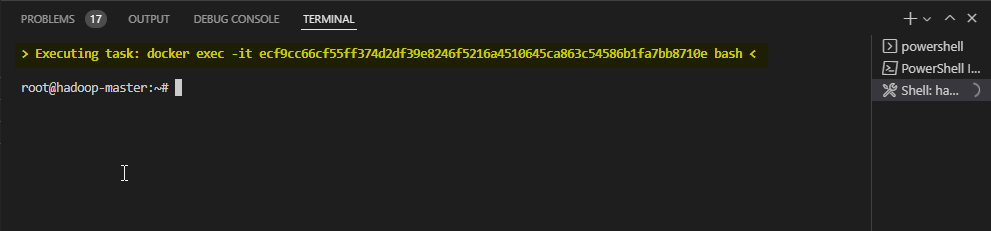

# Sistema de cluster de Hadoop para Docker en windows

## 1. Inicializar el cluster

``` bash
cd DS-M4-Cluster_Hadoop
sudo ./start-container.ps1
```

**output:**

``` bash
start hadoop-master container...
start hadoop-slave1 container...
start hadoop-slave2 container...
All services started 1 Master 2 slaves
root@hadoop-master:~# 
```

- Iniciar con 2  esclavos y un maestro
- Entraremos al contenedor master

## 2. Iniciar hadoop

### Para acceder al contenedor de Hadoop desde vscode

Primero instalamos la extensión para usar docker desde el VSCode



Luego nos aparece un nuevo icono donde podemos ver los containers generados y enlazar una consola a el contenedor


Ya en la consola de VSCode podemos ver que comando que se ejecuto para conectarnos al docker y el promt para comenzar a ingresar nuestros commandos



### Proseguimos desde la consola ingresando los comandos

``` bash
./start-hadoop.sh
```

## 3. Un archivo txt de un libro

Para el ejemplo actual descargaremos un libro

``` bash
wget https://raw.githubusercontent.com/uracilo/testdata/master/odisea.txt
```

## 4. Crear un directorio

Creamos el directorio donde vamos a trabajar los archivos (en este caso el libro anterior)

``` bash
mkdir input
```

## 5. Crear un archivo tipo tar.gz

Este paso lo comprime el archivo (como si fuera un ZIP o RAR) para cargarlo a Hadoop comprimido

``` bash
tar -czvf input/odisea.tar.gz odisea.txt
```

-c: Generar archivo
-z: Comprimir con gzip.
-v: Progreso del proceso.
-f: Especificar nombre del archivo.

## 6. Revisar los tamaños de nuestros archivos

``` bash
ls -flarts input
```

***Output***

``` bash
total 292
  4 drwxr-xr-x 2 root root   4096 May  9 22:04 .
280 -rw-r--r-- 1 root root 284744 May  9 22:04 odisea.tar.gz
  8 drwx------ 1 root root   4096 May 10 11:07 ..
```

## 7. Crear y mover  directorio input al DFS de HADOOP

``` bash
hdfs dfs -mkdir -p test
hdfs dfs -put input
```

## 8. Revisar nuestro input directorio en HADOOP

``` bash
hdfs dfs –ls  input
```

***Output***

``` bash
Found 1 items
-rw-r--r--   2 root supergroup     284744 2022-05-09 22:04 input/odisea.tar.gz
```

## 9. Leer las primeras lineas de nuestro archivo en HADOOP

``` bash
hdfs dfs -cat  input/odisea.tar.gz | zcat | tail -n 20
```

## 10. Eliminar el archivo en HADOOP

``` bash
hdfs dfs –rm –f /user/rawdata/example/odisea.tar.gz
```

## Plus ejecutar un trabajo en HADOOP

``` bash
hadoop jar $HADOOP_HOME/share/hadoop/mapreduce/sources/hadoop-mapreduce-examples-2.7.2-sources.jar org.apache.hadoop.examples.WordCount input output
```

## Plus ver el resultado del trabajo en HADOOP

``` bash
hdfs dfs -cat output/part-r-00000
```

Inspirado en https://github.com/kiwenlau/hadoop-cluster-docker
